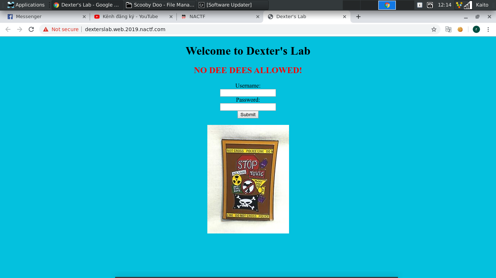
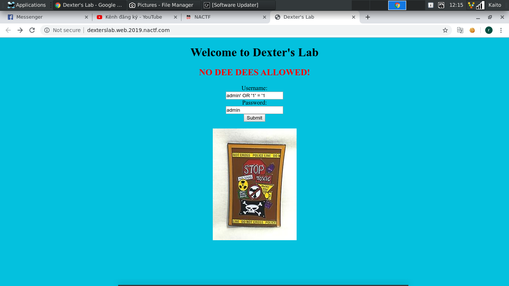
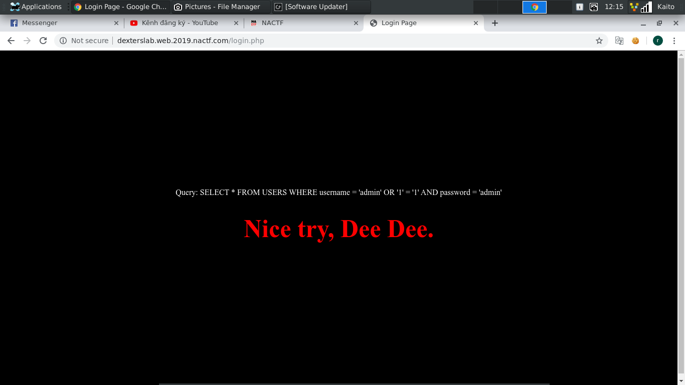
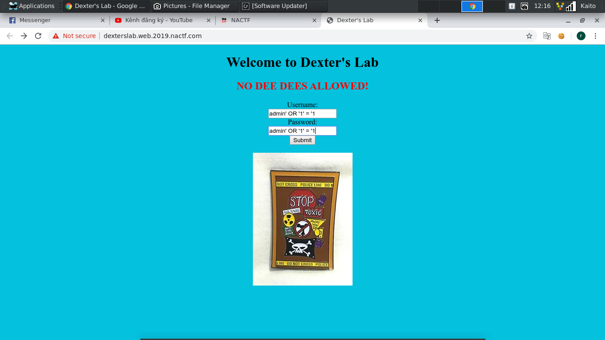
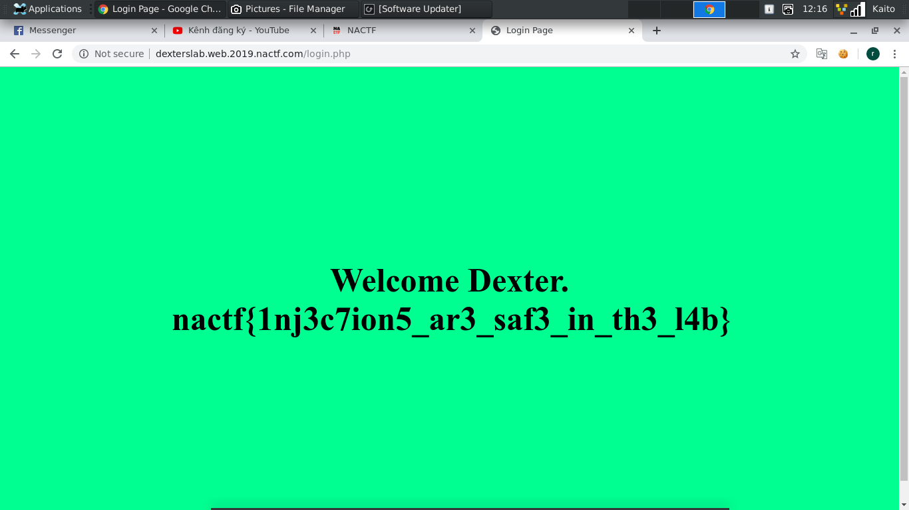

# Dexter's Lab

- Mở đầu trang web là 1 form login đập vào mặt...

- Chả cần nghĩ nhiều lắm, có form login thì thử `sql injection` liền thôi.

- Query đơn giản nhất để thử là `amdin' OR '1' = '1`. Login thử xem có gì xày ra không

- Nhìn sơ qua thì có vẻ `password` cũng bị lỗi luôn. Dễ rồi, thêm query vô phần `password` luôn.

- Lỗi `sql injection` này thì quá cơ bản rồi, chắc không cần nói nhiều làm gì...

