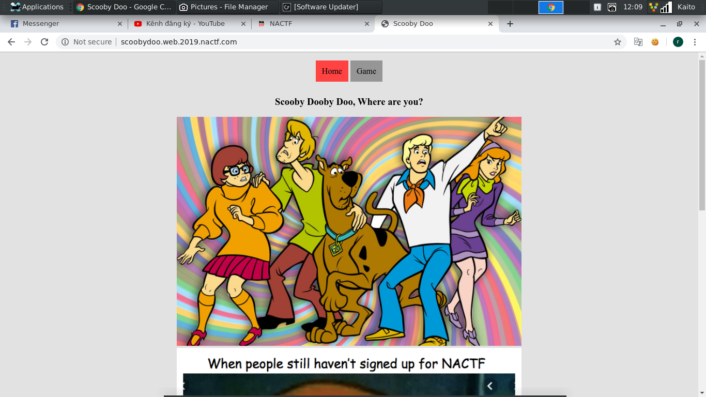
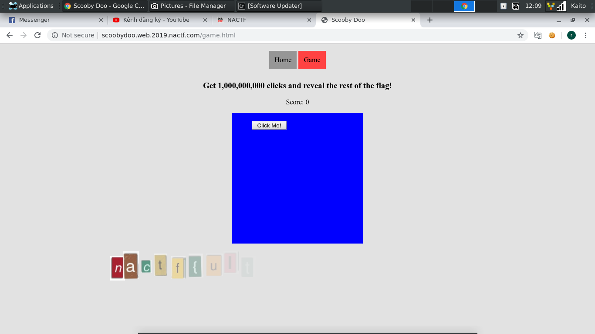
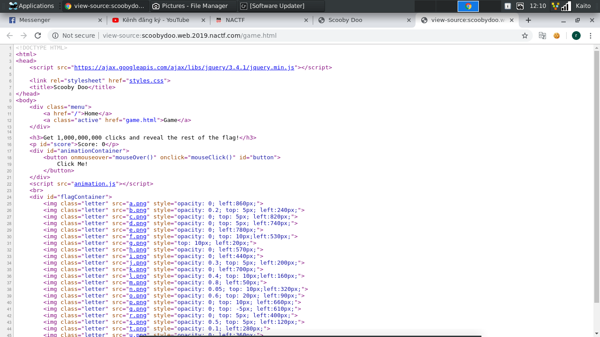
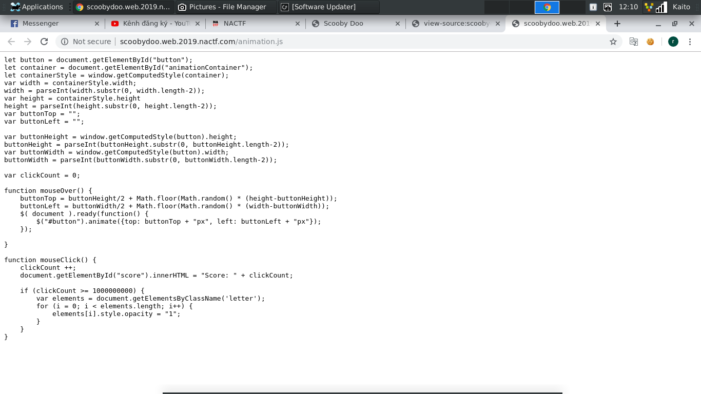
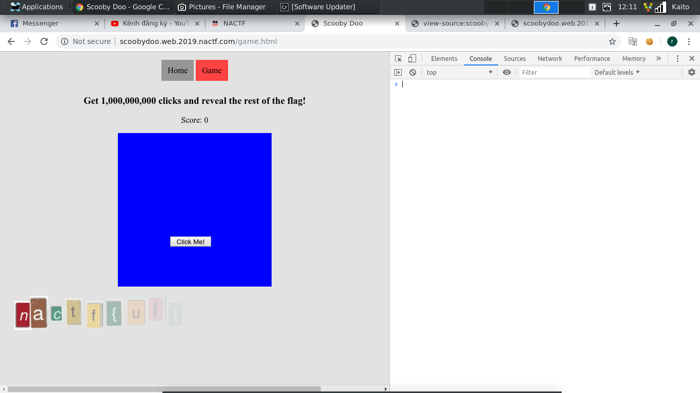
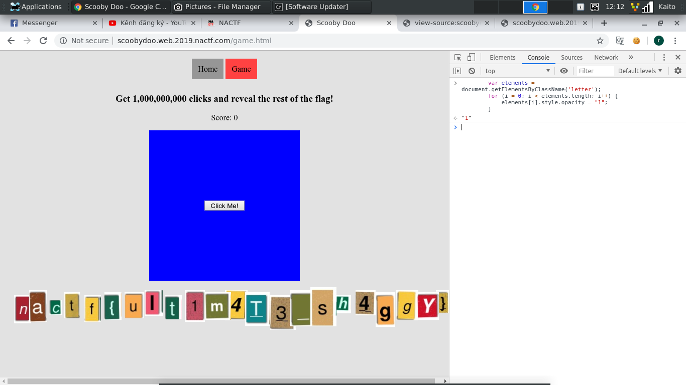

# Scooby Doo

- Mở đầu trang web là cái gì đó chả liên quan, may không mò sâu, tốn thời gian



- Qua page thứ 2, đây có vẻ là 1 trò chơi, click 1.000.000.000 thì nhả flag, ai mà rảnh vậy...



- Theo thói quen thôi, `Ctrl + U` xem có cái gì hay ho không



- Mới đầu xem qua thì có vẻ cái game này nó chạy bằng javascript, để mò vô file js xem có gì hay ho không



- Nhìn tới đoạn `if (clickCount >= 1000000000)` thì biết ngay vấn đề nằm ở đây. clickCount phải đặt hơn 1000000000 mới đưa flag. Mà theo lý thuyết thì khó có thể đạt được, hm hm...

- Thử  `F12` rồi vô `console` rồi dán đoạn code đáng lẽ ra không thể chạy nếu chiếu theo điều kiện xem sao:

```
var elements = document.getElementsByClassName('letter');
   for (i = 0; i < elements.length; i++) {
       elements[i].style.opacity = "1";
   }
```


- Kết quả cũng không bất ngờ lắm, flag hiện luôn.


