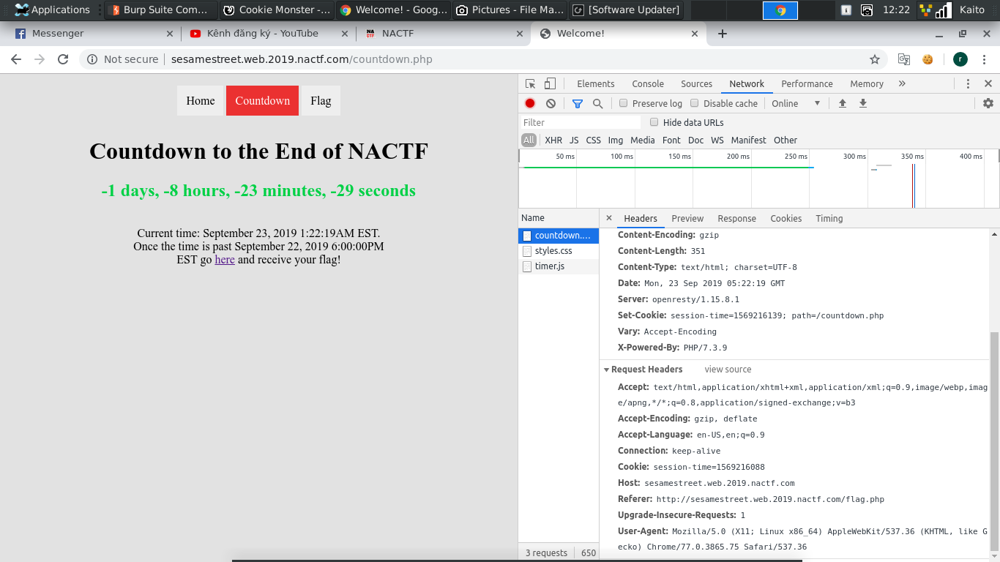

# Sesame Street

- Câu này có vẻ góp vui được tý, cơ mà vẫn dễ quá, thấy Crypto nhiều điểm mà tủi...

- Mới mở trang lên thì thấy ngày chữ cookie. Hint to đùng nằm ngay đây

- Thử lượn lờ vài page còn lại xem có gì không

- Page `Countdown` thì có bộ đếm ngược cho tới thời gian end giải. Nói là end giải mới hiện flag, có ma mới tin...

- Page `Flag` thì bì lỗi không tìm thấy cookie

- Tổng hợp 2 trang kia có vẻ liên quan tới cookie, và set time trên cookie

- Đọc thêm về `Session, cookie` [Link](https://viblo.asia/p/session-cookie-va-cache-ban-da-thuc-su-hieu-chung-3P0lPv3PKox)

- Thử `F12` lên xem có gì hot

- Để ý thì có page `Countdown` có set cookie, còn page `Flag` thì không. Thử dùng `Burp suite` ghi thêm set cookie cho page `Flag`. Để ý thì đoạn thời gian set cho page `Countdown` là `session-time=1569225677; path=/countdown.php` thì `1569225677` là thời gian hiện tại. Chỉ cần thêm vài số để qua thời gian nhận flag là được

- Không bất ngờ lắm, flag lên luôn. Thời điểm viết writeup này thì đã end giải nên bài này không ra flag...
 
